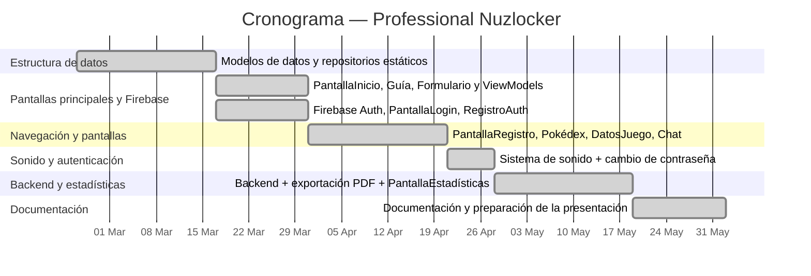
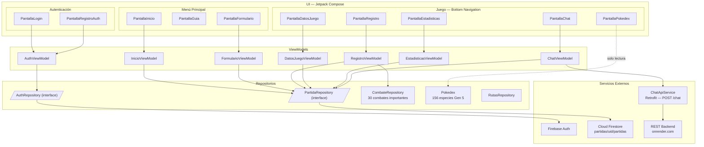
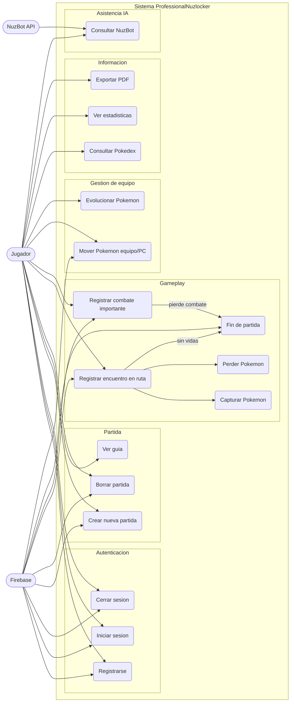
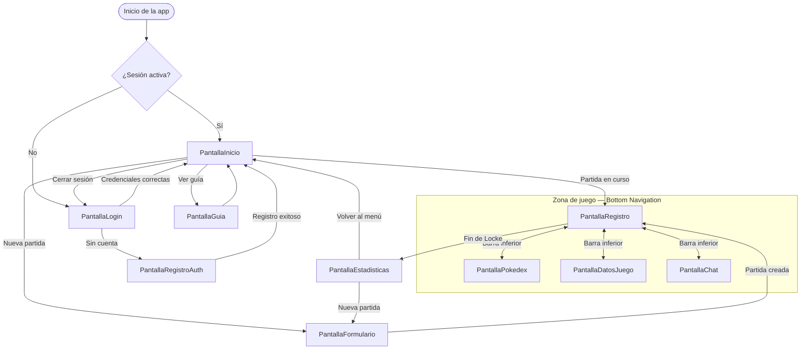
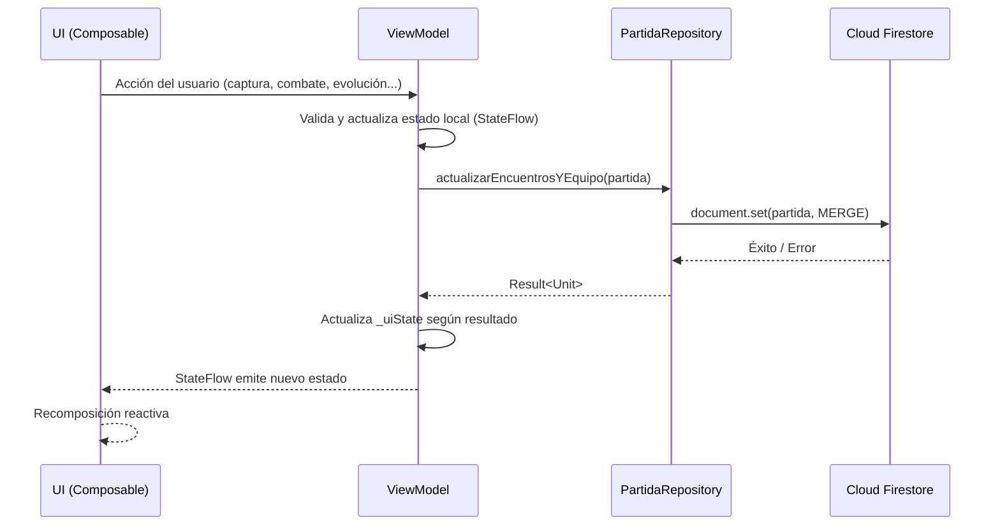

<div align="center">

# PROFESSIONAL NUZLOCKER


### *Cristian Morales Canosa — 19/05/2026*

</div>

---

## Índice

| # | Sección |
|---|---------|
| 1 | [Introducción](#1-introducción) |
| 2 | [Descripción del proyecto](#2-descripción-del-proyecto) |
| 3 | [Objetivos del proyecto](#3-objetivos-del-proyecto) |
| 4 | [Alcance del proyecto](#4-alcance-del-proyecto) |
| 5 | [Requisitos del proyecto](#5-requisitos-del-proyecto) |
| 6 | [Planificación del proyecto](#6-planificación-del-proyecto) |
| 7 | [Plan de gestión de riesgos](#7-plan-de-gestión-de-riesgos) |
| 8 | [Diseño](#8-diseño) |
| 9 | [Instalación y preparación](#9-instalación-y-preparación) |
| 10 | [Documentación de ejecución y plan de calidad](#10-documentación-de-ejecución-y-plan-de-calidad) |
| 11 | [Distribución](#11-distribución) |
| 12 | [Manuales](#12-manuales) |
| 13 | [Conclusiones](#13-conclusiones) |
| 14 | [Anexos](#14-anexos) |
| 15 | [Índice de tablas e imágenes](#15-índice-de-tablas-e-imágenes) |
| 16 | [Bibliografía y referencias](#16-bibliografía-y-referencias) |

---

## 1. Introducción

### Justificación del proyecto

Pokémon es una de las sagas de videojuegos más populares y reconocidas del mundo, centrada en la exploración, la captura y el combate entre criaturas llamadas Pokémon. Dentro de esta franquicia, títulos como Pokémon Negro y Pokémon Blanco marcaron especialmente mi interés por la saga, tanto por su historia como por la variedad de personajes y criaturas.

En el ámbito de esta franquicia, un Nuzlocke es un reto autoimpuesto en estos juegos que lleva más de dos décadas de historia en la comunidad Pokémon. Sus reglas básicas, como capturar únicamente el primer Pokémon de cada ruta, perder de forma permanente a los que se debilitan, etc., convierten cualquier partida en una experiencia narrativa única, cargada de tensión y apego emocional hacia el equipo, agregándole dificultad y emoción a los que buscan algo más desafiante y diferente.

Sin embargo, gestionar un Nuzlocke manualmente supone un esfuerzo considerable, porque el jugador debe llevar la cuenta de qué rutas ya ha visitado, qué Pokémon ha capturado o perdido, qué combates importantes ha superado, cuántas vidas le quedan... Hoy en día, la mayoría de jugadores, bajo mi experiencia, recurren a hojas de cálculo, blocs de notas en teléfonos, o aplicaciones genéricas de listas, ninguna de las cuales están diseñadas específicamente para este reto.

Professional Nuzlocker es un proyecto que cubre específicamente esto, ya que su fin es el de ofrecer una herramienta móvil nativa, elegante y centrada en la experiencia de un Nuzlocke, que además integra inteligencia artificial (IA) para asistir al jugador durante la partida.

Además del interés técnico y de diseño que supone desarrollar esta aplicación, el proyecto surge también de una motivación personal, ligada a mi afición por los juegos de Pokémon, especialmente Pokémon Blanco/Negro, y por otros referentes en plataformas de streaming como YT que impulsan mi afán por jugar de esta forma tan desafiante y divertida.

---

### Análisis comparativo de aplicaciones similares

Como aplicación de registro de Nuzlockes, no hay demasiada variedad. No obstante, sí existen herramientas que pueden llegar a ayudar de alguna forma a guardar el progreso de una partida.

A continuación se resumen las principales alternativas existentes y sus limitaciones:

| Aplicación / Herramienta | Plataforma | Proósito de Nuzlocke | Seguimiento de Pokémon | IA integrada |
|--------------------------|-----------|:----------------------:|:----------------------:|:------------:|
| Hojas de cálculo (Google Sheets) | Web / Móvil | ✗ | Manual | ✗ |
| Nuzlocke Tracker (web) | Web | ✓ | Orientado pero molesto | ✗ |
| Blocs de notas | Multiplataforma | ✗ | Manual | ✗ |
| **Professional Nuzlocker** | Android | ✓ | Orientado y lógico | ✓ |

Ninguna solución existente combina un seguimiento completo del Nuzlocke cómodo y suficientemente eficaz con una integración de IA funcional.

---

### Tendencias

En el proyecto se integran dos tendencias tecnológicas actuales:

- **Integración de IA en aplicaciones móviles:** El uso de la IA en diferentes aplicaciones se ha visto muy impulsado recientemente. Esto es evident al verse integradas en aplicaciones de Google (Gmail, Google Docs, Google Sheets, etc.), que emplean IA para ayudar al usuarioa entender mejor el contexto y moverse mejor por el entorno de la aplicación. Sobre esto, Professional Nuzlocker aprovecha esta tecnología para ofrecer respuestas específicas y servibles a momentos o decisiones importantes en las partida del jugador.

- **Desarrollo Android con Jetpack Compose:** La interfaz de Jetpack Compose es uno de los estándares más novedosos y de los mejores para el desarrollo nativo de aplicaciones Android, permitiendo la creación de interfaces dinámicas y estilizadas utilizando poco código. Además, su avance por las arquitecturas modernas de Android permite una rápida evolución del software y mayor eficiencia en el mantenimiento a gran escala, requisito muy clave a la hora de escoger interfaces para proyectos grandes y/o largos.

---

### Beneficios o expectativas del proyecto

- El jugador nunca pierde información de su partida. Todas las capturas, muertes, combates y estadísticas quedan persistidas en la nube mediante Firebase Firestore, vinculadas a su cuenta personal. Incluso si el jugador decide empezar una nueva partida, su antiguo intento podrá ser guardado a través de la generación de un documento PDF con suficiente información para no olvidar nada.
- La integración con NuzBot reduce el tiempo que el jugador dedica a buscar información externa durante la partida, ya que la IA responde realmente rápido a cualquier pregunta.
- La aplicación sirve como referencia técnica de una arquitectura Android moderna (MVVM, Compose, Firebase, API REST) aplicada a un dominio concreto y bien acotado.
- Bajo temas personales, el principal beneficio es la mera existencia de una herramienta concreta para este tipo de retos que sea suficientemente eficaz y cómoda para poder ser usada de forma continua y diaria por aquellos que son apasionados por la saga.

---

## 2. Descripción del proyecto

### Tipo de proyecto

Como se ha comentado anteriormente, **Professional Nuzlocker** es una **aplicación Android nativa**, la cuál está desarrollada únicamente en Kotlin con Jetpack Compose. Sigue el patrón de arquitectura **MVVM** (Model-View-ViewModel) y utiliza Firebase como backend para autenticación y almacenamiento de datos en tiempo real.

---

### Características principales

| Característica | Descripción | Ventaja |
|----------------|-------------|---------|
| **Autenticación** | Registro e inicio de sesión con correo y contraseña mediante Firebase Auth. | Privacidad de partidas para cada usuario. |
| **Formulario de inicio** | Configuración de la partida (versión del juego, sexo, nombre e inicial). | Asistencia a la hora de empezar el registro. |
| **Registro de rutas** | Lista completa de rutas del juego. En cada ruta el jugador registra el encuentro, donde captura, debilita o espera al encuentro de Pokémon. | Libertad y ayuda para planear encuentros. |
| **Seguimiento de combates** | Registro de combates importantes con el equipo usado en cada uno. | Guía de ayuda para momentos críticos del juego. |
| **Gestión del equipo** | Vista detallada del equipo activo, PC y cementerio, con edición de mote, nivel, habilidad y evolución. | Fluidez a la hora del registro de Pokémon. |
| **Sistema de vidas** | Cada muerte descuenta una vida, donde al llegar a cero el Nuzlocke termina automáticamente. | Añadido de dificultad y ayuda al registro. |
| **NuzBot (IA)** | Asistente conversacional que responde preguntas sobre la partida en curso usando el contexto real de Firestore. | Asistencia clara para resolver dudas ofreciendo estrategias o datos. |
| **Estadísticas** | Resumen final con resultado, ranking de Pokémon más usados, combates más mortales, rivales más letales y distribución de tipos. | Datos importantes para recordar o revisar. |
| **Exportación PDF** | Generación y descarga de un informe completo en la carpeta Descargas del dispositivo. | Guardado del resultado para poder empezar una nueva. |
| **Pokédex integrada** | Navegador de los Pokémon disponibles con buscador por nombre, ofreciendo dónde capturar o cómo evolucionar cada uno. | Información relevante para cada Pokémon. |
| **Música y sonido** | Banda sonora con fundido cruzado al iniciar combates y efectos de sonido contextuales. | Ambiente al navegar por la UI. |

---

### Usuarios destinatarios

La aplicación, como es de esperar, está dirigida a un perfil único y bien definido:

> **Jugador de Pokémon aficionado al reto Nuzlocke**, con conocimientos básicos de las reglas del desafío, que quiere sustituir sus hojas de cálculo o notas manuales por una herramienta móvil dedicada, con la que sentirse a gusto registrando cualquier dato.

No se requiere ningún conocimiento técnico para usar la aplicación. El flujo introductorio guía al jugador desde el registro hasta el inicio de la partida de forma intuitiva. De ahí en adelante, todo es muy sencillo e intuible de usar.

Si el jugador novato e inexperto en el ámbito de los Nuzlockes quiere usar la aplicación, no estará perdido acerca de normas y comportamientos de este modo de juego, debido a que la [**Pantalla de Guía**](app/src/main/java/com/example/professionalnuzlocker/ui/screens/guide/PantallaGuia.kt) le informará de cualquier concepto que necesite saber.

---

## 3. Objetivos del proyecto

### Objetivo general

Desarrollar una aplicación Android completa que permita al usuario **registrar, seguir y analizar una partida Nuzlocke** de Pokémon Negro/Blanco, con persistencia en la nube e integración de un asistente de inteligencia artificial contextual.

---

### Objetivos específicos

1. **Implementar un sistema de autenticación seguro:** Logrado mediante Firebase Authentication, con validación de campos y mensajes de error localizados en español (ES).

2. **Diseñar y desarrollar la estructura de datos de la partida:** Todas las rutas, capturas, combates, y equipo, PC y cementerio y persistirla en tiempo real en Firebase Firestore.

3. **Construir el flujo completo de registro de la aventura:** Selección de ruta activa, captura o pérdida del Pokémon encontrado, registro de combates importantes con el equipo utilizado y gestión de muertes con causa detallada.

4. **Desarrollar la pantalla de gestión del equipo:** Funcionalidades de edición de datos del Pokémon y registro de evoluciones, diferenciando equipo activo, PC y cementerio.

5. **Integrar NuzBot:** Asistente de IA conversacional que recibe el contexto de la partida actual y responde preguntas del jugador a través de un endpoint REST protegido con Firebase ID Token.

6. **Generar un informe de estadísticas:** Al finalizar la partida muestra victoria/derrota, capturas, ranking de Pokémon más usados, combates más mortales, rivales más letales y distribución de tipos en una pantalla.

7. **Implementar la exportación a PDF:** El informe de estadísticas es exportado, guardándolo en la carpeta Descargas del dispositivo como archivo PDF.

8. **Garantizar una experiencia de usuario coherente y pulida:** Paleta de colores propia, música de fondo con fundido cruzado y efectos de sonido acordes al contexto de cada acción.

---

## 4. Alcance del proyecto

### Qué incluye

Professional Nuzlocker cubre el ciclo completo de una partida Nuzlocke sobre Pokémon Negro/Blanco, desde el registro del usuario hasta la exportación en formato PDF de las estadísticas más importantes de la partida. Esto incluye la autenticación, la configuración de la partida, el registro de rutas y encuentros, la gestión del equipo activo, el manejo de PC y cementerio, el seguimiento de combates importantes, el sistema de vidas con fin automático al llegar a cero, el asistente de IA, las estadísticas finales, la exportación a PDF, una Pokédex completa de los Pokémon del juego, música de fondo con fundido cruzado y efectos de sonido, y una pantalla de guía para jugadores nuevos en el modo Nuzlocke.

### Límites

- La aplicación da soporte únicamente a Pokémon Negro/Blanco, y solo existe versión para Android, por lo que no hay versión iOS ni web.
- Cada cuenta puede tener una única partida activa al mismo tiempo.
- No existe ninguna funcionalidad social ni multijugador con las que comparar partidas.
- El presupuesto para este trabajo es de 0€, por lo que el modelo de IA es gratuito y no tan potente.

### Restricciones

- La aplicación requiere conexión a internet activa para todas sus funciones, ya que tanto Firebase como la API de IA son servicios en la nube.
- El dispositivo debe ejecutar Android 8.0 (API 26) o superior.
- La disponibilidad y la latencia de la IA dependen del servicio externo montado paar ello.
- Al tratarse de un proyecto sin ánimo de lucro, la distribución comercial está limitada por los derechos de propiedad de Nintendo y The Pokémon Company, haciendo difícil su lanzamiento futuro.
- El modelo de IA no es tan eficaz y puede dar errores en sus respuestas.

---

## 5. Requisitos del proyecto

### Requisitos funcionales

El sistema debe permitir el registro e inicio de sesión de usuarios con correo electrónico y contraseña, contando también con el cierre de sesión de cuenta. Una vez dentro, el jugador puede configurar una nueva partida indicando la versión del juego, su nombre, sexo y Pokémon inicial elegido.

Durante la partida, la aplicación muestra la lista completa de rutas de Pokémon Negro/Blanco y permite registrar un encuentro por ruta, indicando si el Pokémon fue capturado, derrotado o si el encuentro está pendiente. El jugador gestiona su equipo activo, PC y cementerio, pudiendo editar el mote, nivel, habilidad y estado de cada uno, así como registrar sus evoluciones. Cada muerte descuenta una vida, y, al llegar a cero, el Nuzlocke finaliza automáticamente independientemente de dónde estés. Los combates importantes se registran junto al equipo utilizado en cada uno en el interior del programa.

NuzBot responde preguntas del jugador utilizando el contexto real de su partida almacenada en Firestore. Al terminar la partida, se muestra una pantalla de estadísticas con el resultado, rankings de Pokémon más usados, combates más mortales, rivales más letales y distribución de tipos, que puede exportarse como PDF a la carpeta Descargas del dispositivo. La aplicación también incluye una Pokédex de la región Teselia con buscador por nombre, música de fondo con fundido cruzado, efectos de sonido contextuales y una pantalla de guía con las reglas del modo Nuzlocke.

### Requisitos técnicos

La aplicación está desarrollada de forma nativa en Android usando Kotlin y Jetpack Compose, siguiendo el patrón de arquitectura MVVM. La versión mínima de Android soportada es la 8.0 (API 26). La autenticación se gestiona con Firebase Authentication, la persistencia de datos en tiempo real con Firebase Firestore, y la comunicación con NuzBot a través de un endpoint REST protegido con Firebase ID Token. Los PDF se generan y guardan en la carpeta `Downloads` del dispositivo. El entorno de desarrollo es Android Studio, y el control de versiones se gestiona con Git y GitHub.

### Requisitos legales y normativos

La aplicación debe cumplir el Reglamento General de Protección de Datos (RGPD) en cuanto al almacenamiento y tratamiento de datos personales de usuarios europeos, y respetar los Términos de Servicio de Google y Firebase. Al ser un proyecto sin ánimo de lucro, el uso de nombres, términos e imágenes de Pokémon debe ajustarse a las directrices de Nintendo y The Pokémon Company para proyectos no comerciales. En caso de distribución mediante Google Play, sería necesario proporcionar una política de privacidad accesible al usuario. Los datos del usuario no deben compartirse con terceros de ninguna forma.

---

## 6. Planificación del proyecto

### Estructura de tareas

El desarrollo se organizó en fases secuenciales. La primera fase, de análisis y diseño, cubrió la definición de requisitos, la arquitectura del sistema, el modelado de datos en Firestore y los bocetos de interfaz. A continuación se configuró el entorno de trabajo, siguiendo un proyecto en Android Studio, Firebase y dependencias principales.

El desarrollo de la aplicación se dividió en la UI, la lógica detrás de esta, la conexión con Firebase (Auth y Firestore) y la conexión/creación de un Backend con IA integrada.
- UI: Referido a toda la parte visual del proyecto. Lo que viene a ser las pantallas con sus elementos visuales.
- Lógica: Referido a todas las decisiones tomadas desde dentro del proyecto. Todos los botones de navegación, el sistema de vidas junto al `FIN DE LOCKE`, el sistema de audio silenciado o no, etc.
- Guardado de datos: Referido a conectar un servicio de Firebase para poder guardar y crear usuarios desde la aplicación para guardar en cada uno todo lo necesario.
- Backend: Referido a crear un token gratuito en `OpenRouter` y conectar este a un backend sencillo y fiable definiendo el modelo, pasando el contexto neecsario y limitando su respuesta por fines de productividad a largo plazo.

### Cronograma

El proyecto se desarrolló entre finales de febrero y mayo de 2026, con una duración aproximada de catorce semanas. Como se puede ver en el siguiente cronograma, el principio del desarrollo comenzó declarando los datos necesarios para el futuro de la aplicación, como los objetos [`Pokemon`](app/src/main/java/com/example/professionalnuzlocker/data/model/Pokemon.kt), [`CombateImportante`](app/src/main/java/com/example/professionalnuzlocker/data/model/CombateImportante.kt), [`Rutas`](app/src/main/java/com/example/professionalnuzlocker/data/model/enum_classes/Rutas.kt), [`TipoCombate`](app/src/main/java/com/example/professionalnuzlocker/data/model/enum_classes/TipoCombate.kt), etc.

Tras la primera semana, se estuvo trabajando durante 2 semanas en las clases [`Pokedex`](app/src/main/java/com/example/professionalnuzlocker/data/repository/Pokedex.kt), [`CombateRepository`](app/src/main/java/com/example/professionalnuzlocker/data/repository/CombateRepository.kt) y [`RutasRepository`](app/src/main/java/com/example/professionalnuzlocker/data/repository/RutasRepository.kt), declarando y organizando todos los datos estáticos y globales de la aplicación para todos los usuarios.

Tras esto, y durante 2 semanas, se programaron las pantallas principales ([`PantallaInicio`](app/src/main/java/com/example/professionalnuzlocker/ui/screens/home/PantallaInicio.kt), [`PantallaGuia`](app/src/main/java/com/example/professionalnuzlocker/ui/screens/home/PantallaInicio.kt), [`PantallaFormulario`](app/src/main/java/com/example/professionalnuzlocker/ui/screens/form/PantallaFormulario.kt)) junto a sus ViewModels ([`PantallaInicioViewModel`](app/src/main/java/com/example/professionalnuzlocker/ui/screens/home/PantallaInicioViewModel.kt), [`PantallaFormularioViewModel`](app/src/main/java/com/example/professionalnuzlocker/ui/screens/form/PantallaFormularioViewModel.kt)). Además, la lógica de Firebase también se pudo conseguir en esta semana, junto a las pantallas [`PantallaLogin`](app/src/main/java/com/example/professionalnuzlocker/ui/screens/auth/PantallaLogin.kt) y [`PantallaRegistroAuth`](app/src/main/java/com/example/professionalnuzlocker/ui/screens/auth/PantallaRegistroAuth.kt).

Por las siguientes 3 semanas, el sistema de navegación entre [`PantallaRegistro`](app/src/main/java/com/example/professionalnuzlocker/ui/screens/register/PantallaRegistro.kt), [`PantallaPokedex`](app/src/main/java/com/example/professionalnuzlocker/ui/screens/pokedex/PantallaPokedex.kt), [`PantallaDatosJuego`](app/src/main/java/com/example/professionalnuzlocker/ui/screens/infoRun/PantallaDatosJuego.kt) y [`PantallaChat`](app/src/main/java/com/example/professionalnuzlocker/ui/screens/chat/PantallaChat.kt) estaría completado, y las 3 primeras ya funcionales parcialmente, mostrando Pokémon, rutas y combates adecuadamente.

La siguiente semana todo el trabajo se centró en el sonido y cambio de contraseña de Auth en la aplicación.

Por último, en las semanas 10-12 se realizó, en su mayoría, el funcionamiento del [`Backend`](https://github.com/moraalees/ProfessionalNuzlocker-BE), siguiendo el guardado de archivos PDF y la [`PantallaEstadisticas`](app/src/main/java/com/example/professionalnuzlocker/ui/screens/stats/PantallaEstadisticas.kt).

Las semanas 13-14 fueron dedicadas a documentación del proyecto y preparación de la presentación de este.



### Recursos necesarios

**Recursos técnicos:** Android Studio como IDE principal, Kotlin y Jetpack Compose para el código de la aplicación, Git y GitHub para el control de versiones, Firebase Authentication y Firestore como backend, un servicio REST externo para NuzBot, una librería Android de generación de PDF, Coil para la carga de imágenes en la Pokédex, Retrofit para el consumo de la API de NuzBot, y al menos un dispositivo Android físico o emulador para las pruebas de funcionamiento y comportamiento.

**Recursos humanos:** Un único desarrollador, responsable de todo el proceso de desarrollo de inicio a fin, contando el análisis, diseño, desarrollo, pruebas y documentación del proyecto.

---

## 7. Plan de gestión de riesgos

### Identificación y evaluación de riesgos

- **Expansión descontrolada del alcance**: Probabilidad baja/media, impacto alto. Es el riesgo más prioritario del proyecto, ya que la adición de funcionalidades no planificadas puede comprometer el calendario y los objetivos del TFG.

- **Interrupción o cambio en la API de Firebase**: Probabilidad muy baja, impacto alto. Una rotura en la autenticación o en Firestore dejaría la aplicación sin backend funcional, por lo que ningún usuario podría crear una cuenta y mucho menos guardar sus partidas, inutilizando toda la aplicación.

- **Corte o limitación de tasa del servicio de IA**: Probabilidad media, impacto medio/bajo. NuzBot depende de un servicio externo (Render). Si este no está disponible, el asistente queda inoperativo completamente.

- **Retrasos por subestimación de tareas**: Probabilidad media, impacto medio. Habitual en proyectos individuales donde no hay margen para redistribuir carga.

- **Pérdida o corrupción de datos en Firestore**: Probabilidad muy baja, impacto alto. Aunque sea bastante improbable, podría suponer la pérdida de toda la partida del usuario e inutilizar cualquier lógica dentro del proyecto.

- **Incompatibilidad con versiones de Android no probadas**: Probabilidad baja, impacto medio. El amplio rango de versiones soportadas puede introducir comportamientos inesperados.

- **Errores en la generación del PDF en dispositivos concretos**: Probabilidad baja, impacto bajo. La fragmentación del ecosistema Android puede provocar fallos puntuales en la exportación del archivo.

- **Alta latencia en las respuestas de NuzBot**: Probabilidad media, impacto bajo. Afecta a la UX, pero no a la funcionalidad como tal.

### Recursos preventivos

- Para evitar el scope creep, el alcance se definió desde el inicio, evaluando cualquier nueva funcionalidad frente al calendario antes de implementarla.

- Para mitigar la dependencia de Firebase, la arquitectura MVVM aísla la capa de datos en repositorios intercambiables.

- NuzBot muestra un indicador de carga visible y un mensaje de error claro cuando el servicio no responde.

- El desarrollo se estructuró en tareas pequeñas con estimaciones realistas y revisión semanal del progreso.

- Las reglas de seguridad de Firestore protegen contra escrituras no autorizadas, y la estructura de datos se valida en el ViewModel antes de persistirse.

### Plan de mitigación de consecuencias

- Si Firebase sufre una interrupción grave, la capa repositorio permite migrar a otro proveedor (Supabase, Room local, ...) sin reescribir la lógica de negocio.

- Si NuzBot deja de estar disponible, se desactiva su sección en la interfaz y se muestra un aviso al usuario, estudiando un proveedor alternativo.

- Si se materializan retrasos, se reduce el pulido visual para priorizar la funcionalidad nuclear y se ajusta el cronograma.

- Si se produce corrupción de datos en Firestore, el historial interno del servicio permite restaurarlos. En un caso ya más extremo, se ofrece al usuario reiniciar la partida.

---

## 8. Diseño

### Prototipado

Para poder plasmar y sentar las ideas sobre algunas pantallar y mecánicas, se ha optado por el uso de diferentes bocetos los cuáles servirían de guía para el desarrollo de diseño.

1. `Pantalla Datos del Juego`. Esta pantalla mostraría los Pokémon que capturar y los combates a experimentar durante el desarrollo de la partida, pudiendo escoger qué Pokémon se capturó en cierta ruta, qué combates se han vencido, qué Pokémon están en el equipo en todo momento, etc. [`Boceto`](AppDesign/BocetoPantallaDatosJuego.png) / [`Resultado`](AppDesign/PantallaDatosJuego.jpeg)
2. `Pantalla Pokedex`. Esta pantalla mostraría todos los Pokémon disponibles en los juegos de pokémon Negro/Blanco. Cada uno junto a sus tipos, línea evolutiva, habilidades, etc. [`Boceto`](AppDesign/BocetoPantallaPokedex.png) / [`Resultado`](AppDesign/PantallaPokedex.jpeg)
3. `Pantalla Estadísticas`. Esta pantalla mostraría todos los datos relevantes de la partida de un jugador. Se recolectarían los Pokémon más usados, los tipos de Pokémon más capturados, etc. [`Boceto`](AppDesign/BocetoPantallaEstadisticas.png) / [`Resultado1`](AppDesign/PantallaEstadisticas1.jpeg) - [`Resultado2`](AppDesign/PantallaEstadisticas2.jpeg)

### Especificaciones técnicas

| Elemento | Detalle |
|----------|---------|
| **Lenguaje** | Kotlin |
| **UI framework** | Jetpack Compose (Material 3) |
| **Arquitectura** | MVVM (Model-View-ViewModel) |
| **Navegación** | Jetpack Navigation Compose |
| **Autenticación** | Firebase Authentication |
| **Base de datos** | Cloud Firestore — colección `partidas/{uid}/partidas` |
| **API IA** | REST propio en Render — `POST /chat`, autenticado con Firebase ID Token |
| **Cliente HTTP** | Retrofit + OkHttp (timeout 60 s) |
| **Carga de imágenes** | Coil |
| **Generación PDF** | Librería Android nativa, guardado en `Downloads/` |
| **Audio** | MediaPlayer |
| **Versión mínima Android** | 8.0 (API 26) |
| **IDE** | Android Studio |
| **Control de versiones** | Git + GitHub |

La aplicación no usa base de datos local ya que Firestore actúa como única fuente de verdad para el estado de la partida. Los datos estáticos del juego se mantienen en singletons en memoria , cargados una sola vez al arrancar la app.

### Diagramas

#### Diagrama de componentes

Muestra cómo se organizan y conectan los componentes de la aplicación en tres capas principales. La capa UI agrupa todas las pantallas Compose, divididas en el flujo de autenticación, el menú principal y las cuatro pantallas de juego accesibles mediante la barra de navegación inferior.

Cada pantalla, si toca, delega su lógica en un ViewModel propio, que a su vez se comunica con la capa de repositorios. Los repositorios de autenticación y de partida son interfaces con implementación Firebase, mientras que `Pokedex`, `CombateRepository` y `RutasRepository` son singletons en memoria con datos estáticos del juego. El `ChatViewModel` es el único que además llama directamente al servicio REST externo a través de `ChatApiService`.



#### Diagrama de casos de uso

Muestra qué puede hacer cada actor del sistema. El `Jugador` es el actor principal e interactúa con prácticamente todos los casos de uso. `Firebase` participa como actor secundario en todo lo relacionado con autenticación y persistencia de la partida. `NuzBot API` es el actor externo que resuelve las consultas del asistente IA.

Los casos de uso de `Gameplay` tienen relaciones de inclusión, como al registrar un encuentro en ruta que desemboca siempre en capturar o perder un Pokémon. El fin de partida se dispara automáticamente por perder un combate importante o por perder a más de 10 Pokémon.



---

## 9. Instalación y preparación

### Procedimientos para hacer funcionar el proyecto

Para ejecutar Professional Nuzlocker en local se necesita tener instalado Android Studio con el SDK de Android y un dispositivo físico o emulador con Android 8.0 (API 26) o superior.

Los pasos a seguir son los siguientes:

1. Clonar el repositorio desde GitHub, usando la clave HTTPS `https://github.com/moraalees/ProfessionalNuzlocker-TFG.git` en el comando.
2. Abrir el proyecto en Android Studio con *Open an existing project*.
3. Añadir el archivo `google-services.json` en la carpeta `app/`. Este archivo se obtiene desde la consola de Firebase del proyecto y no está incluido en el repositorio por razones de seguridad. Sin él, la autenticación y Firestore no funcionarán, y la palicación será totalmente inútil.
4. Sincronizar las dependencias de Gradle pulsando *Sync Now* cuando Android Studio lo solicite.
5. Conectar un dispositivo Android con depuración USB activada, o lanzar un emulador desde el AVD Manager.
6. Una vez el dispositivo o emulador estén activos, ejecutar la aplicación con el botón *Run* o con `Shift + F10`.

El backend de NuzBot ya está desplegado en Render y no requiere ninguna configuración adicional por parte del desarrollador. Las llamadas a la API se autentican automáticamente con el token de Firebase del usuario en sesión.

### Procedimientos para el control de versiones

El proyecto utiliza Git con un repositorio remoto en GitHub. Al ser un proyecto individual, el flujo de trabajo es sencillo y directo, ya que se trabaja siempre sobre la rama `main`, sin ramas de feature ni pull requests. Los cambios se confirman con commits cortos que reflejan qué se ha modificado o añadido.

En un contexto de equipo, lo recomendable sería adoptar un flujo basado en ramas, como un modelo más ligero con una rama por funcionalidad (`feature/nombre`) que se integra en `main` mediante PRs (pull requests), con al menos una revisión de otro miembro antes de hacer el merge, permitiendo aislar cambios, detectar conflictos antes de que lleguen a la rama principal y mantener un historial más claro.

### Procedimientos para registrar las incidencias

Al tratarse de un proyecto en solitario, no se sigue ningún procedimiento formal o eficaz para el registro de incidencias. Cuando aparece un error o un comportamiento inesperado durante el desarrollo o las pruebas, se identifica la causa y se corrige directamente en el código o desde el repositorio, confirmando el cambio con un commit que identifique de manera simple el problema resuelto.

En un entorno de equipo, lo adecuado sería utilizar GitHub Issues, para registrar cada incidencia. Cada issue debería incluir una descripción clara del problema, los pasos para reproducirlo, el comportamiento esperado frente al observado y capturas de pantalla o logs relevantes que identifiquen de manera detallada el problema. Las incidencias se etiquetarían por tipo y se asignarían a un responsable, cerrándose una vez verificada la corrección.

---

## 10. Documentación de ejecución y plan de calidad

### Procedimientos operativos

Cuando se despliega la aplicación, Android inicializa el grafo de dependencias de Compose y vuelve a usar la sesión activa (si hay) de Firebase Authentication. Si el usuario ya tiene sesión activa, se navega directamente a `PantallaInicio`, donde se consulta Firestore para determinar si existe una partida en curso. Si es así, el jugador accede a dicha pantalla. En caso contrario, aparecerá en `PantallaLogin` para que o bien inicie su sesión o bien cree una cuenta.

Durante el ciclo de vida de la aplicación, cada pantalla delega su estado en un ViewModel propio (si tiene) que expone `StateFlow`. Cuando el usuario realiza una acción, el ViewModel actualiza el estado local para mantener la interfaz reactiva y propaga el cambio a Firestore mediante una corrutina. Si la operación en la nube falla, el error se notifica al usuario mediante un mensaje visible en pantalla, sin revertir el estado local.

El sistema de audio funciona de forma independiente a la navegación. `AudioManager` gestiona dos `MediaPlayer` con fundido cruzado de 1 segundo al pasar de la música de exploración a la música de combate, y viceversa. Los efectos de sonido suaves, como el clic, subida de nivel y captura, se reproducen mediante `SoundPool`. Durante una captura, el volumen de la música de fondo se reduce temporalmente 2,5 segundos. El usuario puede alternar el sonido entre silenciado y activo desde un botón en la esquina superior derecha de `PantallaInicio`. El estado de mute se mantiene en memoria durante la sesión y se restablece al reiniciar la aplicación.

La exportación a PDF se lanza desde un botón visible en la última fase de `PantallaEstadisticas`, el resumen final. El documento se construye con las estadísticas calculadas por el ViewModel y se guarda en la carpeta `Downloads/` del dispositivo con el nombre `resumen_aventura.pdf`. Una vez completada la escritura, se muestra un `Toast` con el texto "PDF guardado en Descargas".


### Registro de pruebas

Las pruebas del proyecto son de tipo manual, debido a la sencillez de estas. Estas, fueron ejecutadas sobre un dispositivo físico Android. A continuación se detallan los casos de prueba verificados a lo largo del desarrollo:

#### Autenticación
- Registro con correo y contraseña válidos, verificando la creación del usuario en Firebase Authentication y navegación directa a `PantallaInicio`.
- Intento de registro con correo ya existente, verificando que se muestra el mensaje de error correspondiente.
- Inicio de sesión con credenciales correctas e incorrectas, verificando el comportamiento esperado en ambos casos.
- Cierre de sesión, verificando que el estado de Firestore se libera y el usuario queda sin sesión activa.

#### Configuración de partida
- Creación de nueva partida con distintas combinaciones de versión de juego, sexo, nombre e inicial, verificando que el documento en Firestore tiene la información correspondiente.
- Verificación de que no es posible crear una segunda partida activa mientras existe una en curso.

#### Registro de rutas y encuentros
- Registro de encuentro con captura, verificando que el Pokémon aparece en el equipo activo (si corresponde) y la ruta queda marcada como visitada.
- Registro de encuentro con Pokémon derrotado, verificando que no se bloquee la ruta ni se guarde al Pokémon.
- Verificación del bloqueo de nuevos encuentros en rutas ya visitadas.
- Comprobación del fin automático del Nuzlocke al llegar a cero vidas o perder un combate.

#### Gestión del equipo
- Edición de mote, nivel, habilidad y estado de distintos Pokémon, verificando la persistencia de los cambios en Firestore.
- Registro de evolución, verificando el cambio de especie y la actualización de la imagen en la interfaz.
- Movimiento de Pokémon entre equipo activo y PC, verificando la consistencia de los datos.

#### Combates importantes
- Registro de varios combates con distintos equipos activos, verificando el almacenamiento correcto y su visualización posterior.
- Verificación del fin de un combate importante con bajas, pudiendo anotar los fallecidos por sus respectivas causas y resta de vidas.

#### NuzBot
- Envío de preguntas con partida activa, verificando que la respuesta hace referencia al contexto real de la sesión.

#### Estadísticas y exportación PDF
- Verificación del cálculo correcto de rankings y distribuciones al finalizar la partida.
- Generación y apertura del archivo PDF desde la carpeta `Downloads/`, verificando el contenido del documento.

### Indicadores de calidad

Los siguientes criterios han guiado la evaluación de la calidad del producto a lo largo del desarrollo:

**Estabilidad:** La aplicación no debe presentar cierres inesperados durante el uso común. Todos los flujos principales han sido ejecutados repetidamente en dispositivo físico sin producir ningún crash no controlado. Los errores esperables, como la ausencia de conexión o la falta de respuesta del backend, están manejados y controlados con mensajes de error visibles al usuario.

**Consistencia de datos:** Toda acción que modifique el estado de la partida debe reflejarse de forma coherente en Firestore y en la interfaz. Se ha verificado que no existen diferencias entre el estado mostrado en pantalla y el almacenado en la base de datos tras operaciones de captura, muerte, evolución o fin de partida.

**Persistencia entre sesiones:** Los datos de la partida sobreviven al cierre y reapertura de la aplicación.

**Tiempo de respuesta de NuzBot:** Las respuestas del asistente se obtienen en un tiempo razonable bajo condiciones normales de red. El indicador de carga permanece visible durante la espera y desaparece al recibir la respuesta.

**Corrección del PDF generado:** El archivo exportado debe contener los datos de la partida de forma ordenada y sin errores visuales de organización, abrirse correctamente con el visor de PDF del dispositivo y guardarse en la ruta esperada.

### Métodos de verificación

La verificación del correcto funcionamiento de la aplicación se ha llevado a cabo mediante los siguientes métodos:

**Prueba en dispositivo físico:** El método principal de verificación ha sido ejecutar la aplicación en un dispositivo Android real, recorriendo los flujos completos de uso y comprobando visualmente el comportamiento esperado en cada momento. Estas comprobaciones se han realizado sobre todo a lo largo de la creación del proyecto.

**Inspección de la consola de Firebase:** Tras cada operación que implique escritura en Firestore, se ha verificado directamente en la consola de Firebase que el documento correspondiente contiene los datos correctos. Esto permite detectar cualquier error de información que no sea exacta entre lo que muestra la interfaz y lo que realmente se ha persistido.

**Logcat de Android Studio:** Durante las sesiones de prueba con dispositivo conectado, se ha monitoreado el canal de logs de Android Studio para identificar excepciones, advertencias de Compose y errores de red. Los errores detectados se han corregido en el momento que se ha averiguado la solución a ellos.

**Revisión del archivo PDF generado:** Cada prueba de exportación ha concluido con la apertura del archivo resultante en el visor de PDF del dispositivo, verificando visualmente la presencia e integridad de todos los bloques de contenido esperados.

---

## 11. Distribución

### Tecnología de distribución

Professional Nuzlocker se distribuye como un archivo APK generado directamente desde Android Studio mediante el proceso de compilación del IDE. No se utiliza Google Play Store como canal de distribución ni ningún tipo de sitio de venta online, principalmente debido a las restricciones de propiedad intelectual de Nintendo y The Pokémon Company, que hacen poco porbable la publicación comercial o pública de una aplicación que usa sus datos propios sin autorización expresa, contando también porque es un proyecto sin ánimo de lucro.

El APK se firma digitalmente con un keystore propio generado en Android Studio antes de la compilación, lo que garantiza la integridad del paquete y permite actualizaciones sucesivas sobre el mismo dispositivo sin necesidad de desinstalar la versión anterior. Durante la compilación en modo release, el compilador R8 aplica reducción de código y ofuscación de nombres de clase, lo que reduce el tamaño del APK y dificulta la ingeniería inversa del código fuente. Esto es una función propia del IDE.

El repositorio del proyecto está alojado en GitHub de forma pública, lo que permite acceder al código fuente completo, sin observar, como es evidente, cualquier dato sensible como la configuración de Firebase. Los archivos APK del proyecto pueden adjuntarse como assets de una GitHub Release, ofreciendo una URL de descarga directa y un historial de versiones claro vinculado a commits concretos.

El backend de NuzBot está desplegado de forma permanente en Render, plataforma de hosting en la nube que proporciona un entorno de ejecución continuo sin coste para proyectos de poca demanda. La URL del endpoint es fija y está embebida en la configuración de Retrofit de la aplicación, por lo que no requiere ningún ajuste por parte del usuario final.

### Descripción del proceso

El proceso de distribución de una nueva versión de la aplicación sigue los pasos descritos a continuación:

En primer lugar, se verifica que el código en la rama `main` es estable y que todas las funcionalidades previstas para la versión están completas y probadas. Seguidamente, se abre Android Studio y se accede al menú *Build → Generate Signed Bundle / APK*. Se selecciona la opción APK, se proporciona el keystore del proyecto junto con sus credenciales, se elige la variante `release` y se inicia la compilación.

Una vez concluida la compilación, Android Studio deposita el APK firmado en la ruta `app/release/app-release.apk` dentro del directorio del proyecto. Este archivo es el artefacto final listo para instalar.

Para la distribución del APK existen dos vías:
- Transferencia direcata. Simplemente copiar el archivo al dispositivo mediante cable USB o por cualquier medio de transferencia de archivos, abrir el explorador del dispositivo, localizar el APK y ejecutarlo. El sistema Android solicitará al usuario que habilite la instalación de aplicaciones de orígenes desconocidos si no lo tiene activado previamente.
- GitHub Release. Consiste llanamente en crear una nueva release en el repositorio de GitHub asociada al commit correspondiente, adjuntar el APK como asset y proporcionar las notas de versión pertinentes. Cualquier persona con acceso al repositorio podrá descargar e instalar el archivo desde esa URL.

El backend de NuzBot no requiere un proceso de distribución propio en el contexto de este proyecto, ya que el despliegue en Render es continuo y cualquier actualización del código del repositorio del backend se propaga automáticamente al entorno en producción mediante el pipeline de integración de la plataforma.

---

## 12. Manuales

Para poder entender el flujo de lógica y pantallas desde un punto de vista no profesional para usar la aplicación desde su instalación hasta su final, se ha creado el siguiente [`Manual de Usuario`](info/manual_usuario.md). Este manual contiene una guía para poder instalar el proyecto y cómo usarlo de forma eficaz sin problemas.

---

## 13. Conclusiones

### Informe final

Professional Nuzlocker cumple con casi todos los objetivos establecidos al inicio del desarrollo del proyecto. La aplicación cumple correctamente con el ciclo completo de una partida Nuzlocke sobre Pokémon Negro/Blanco, ya que va desde el registro del usuario hasta la exportación del informe final en PDF, con persistencia en la nube, integración de un asistente de IA contextual y una interfaz coherente y pulida, como se especificó.

Sin embargo, se planeaba desarrollar un backend funcional, para la integración de IA, empleando RAG (Retrieval Augmented Generation). En el presente proyecto, este backend no emplea este sistema, por motivos de poca experiencia en ello y tiempo.

El desarrollo se llevó a cabo en catorce semanas por un único desarrollador, siguiendo el cronograma anteriormente detallado. El alcance definido desde el inicio no ha sido el definitivo, ya que varias decisiones lógicas han sido cambiadas por diversos motivos en cada caso:

- Presencia de 3 partidas. En un principio, se planeaba permitir 3 partidas por jugador/cuenta. No obstante, esta funcionalidad se ha declarado como innecesaria. Con el fin de que el jugador viva de más cerca sus partidas, es mejor que se centre en una sola, en lugar de permitirle llevar 3 a la vez. Si este desea hacer más de 1, podría crearse otra cuenta.
- RAG. Como se ha especificado anteriormente, este sistema para el backend se ha descartado al ser una idea muy grande ppara ser llevada por una experiencia muy básica en backends de IA.

Desde un punto de vista ya técnico, el proyecto ha servido con creces como aplicación práctica de un stack Android moderno, el cuál se compone por MVVM con Jetpack Compose, Firebase como backend completo y consumo de una API REST externa autenticada. El resultado es una arquitectura limpia, mantenible y escalable en la que la separación de capas permite poder expandir funcionalidades o modificar algunas ya existentes sin perjudicar al resto.

A un nivel más personal, el proyecto ha servido como una experiencia satisfactoria que mezcla motivación y aprendizaje. Desarrollar una herramienta que ayuda y resuelve un dilema real dentro de una afición personal ha ayudado a mantener el interés a lo largo de todo el proceso, y el resultado final es una aplicación que yo mismo usaré durante una partida en algún punto de mi vida.

---

### Resultados esperados

| Objetivo específico | Estado |
|---------------------|:------:|
| Autenticación segura con Firebase | ✓ |
| Estructura de datos de la partida en Firestore | ✓ |
| Flujo completo de registro de la aventura | ✓ |
| Gestión del equipo (equipo activo, PC y cementerio) | ✓ |
| Integración de NuzBot (asistente de IA contextual) | ✓ |
| Pantalla de estadísticas con rankings y distribución de tipos | ✓ |
| Exportación a PDF en la carpeta Descargas | ✓ |
| Experiencia de usuario coherente y pulida | ✓ |

Todos los objetivos definidos en la [sección 3](#3-objetivos-del-proyecto) han sido implementados. Las únicas limitaciones conocidas, además de las ya expuestas, tienen que ver con el presupuesto del proyecto:
- El modelo de IA gratuito ofrece una capacidad de respuesta inferior a los modelos de pago.
- El backend alojado en Render puede introducir latencia variable en los cold starts del servicio.

---

### Viabilidad del proyecto

Professional Nuzlocker demuestra su viabilidad técnica y funcional como proyecto de desarrollo individual. Los recursos tecnológicos utilizados son todos gratuitos en su nivel básico, lo que permite mantener la aplicación en producción sin siquiera coste alguno.

En cuanto a la viabilidad como producto, la aplicación cubre una necesidad personal y real que no cubre actualmente ninguna herramienta existente. Sin embargo, su proyección comercial no está prevista por las restricciones de propiedad intelectual de Nintendo y The Pokémon Company, que hacen inviable una distribución pública a gran escala sin un acuerdo de licencia expreso, tal como se recoge en la [sección 4](#4-alcance-del-proyecto).

Si el proyecto evolucionara hacia una versión con datos propioso tergiversados, su viabilidad de distribución mejoraría de forma significativa. En su estado actual, es una herramienta completamente funcional para uso personal y de comunidad.

---

### Mejoras futuras

Las siguientes mejoras representan extensiones naturales del proyecto que no entraron en el alcance inicial por restricciones de tiempo o presupuesto:

- **Soporte para más generaciones de Pokémon:** Ampliar la cobertura a otros juegos de la saga añadiendo sus respectivas rutas, combates y Pokédex.
- **Reglas Nuzlocke personalizables:** Permitir al jugador definir sus propias reglas (número de vidas, *Species Clause*, *Sleep Clause*, etc.) haría la aplicación más flexible.
- **Sistema de logros:** Introducir logros desbloqueables (primera captura, partida completada sin muertes, todos los gimnasios superados sin bajas, etc.) añadiría una motivacoón extra y haría cada aventura más intensa.
- **Exportación PDF mejorada:** Incorporar imágenes de los Pokémon del equipo final y un diseño más elaborado en el documento generado.
- **Historial de partidas:** Permitir al usuario revisar sus Nuzlockes anteriores y comparar estadísticas entre ellos.
- **Modo sin conexión:** Implementar una caché local con Room para registrar rutas y capturas sin conexión, sincronizando con Firestore al recuperarla.
- **Modelo de IA más potente:** Sustituir el modelo gratuito de OpenRouter por uno comercial mejoraría con grandes creces la calidad y precisión de las respuestas de NuzBot, especialmente en consultas sobre estrategia avanzada.
- **Versión iOS o web:** Extender la aplicación a otras plataformas permitiría llegar a jugadores fuera del ecosistema Android.

---

## 14. Anexos

### Diagramas ampliados

#### Diagrama de flujo de navegación

El siguiente diagrama refleja el flujo de navegación completo de la aplicación, exponiendo todas las funcionalidades posibles entre pantallas y las condiciones que las provocan:



#### Diagrama de flujo de datos de la partida

Muestra el ciclo de vida del objeto `Partida` desde que el usuario realiza una acción en la interfaz hasta que el cambio queda persistido en Firestore y la UI se actualiza de forma reactiva.



#### Estructura de datos en Firestore

El siguiente árbol refleja la jerarquía de colecciones y campos almacenados en Firestore para cada partida de un usuario.

```
partidas/                                    ← colección raíz
└── {uid}/                                   ← documento por usuario (Firebase Auth UID)
    └── partidas/                            ← subcolección de aventuras
        └── {docId}                          ← documento de la partida activa
            ├── versionJuego: "Negro" | "Blanco"
            ├── nombreJugador: String
            ├── sexoJugador: "Masculino" | "Femenino"
            ├── pokemonInicial: "Snivy" | "Tepig" | "Oshawott"
            ├── vidas: Int                   ← empieza en 10; llegar a 0 = fin
            ├── finDeLocke: Boolean
            ├── consultasIA: Int
            ├── createdAt: Timestamp
            ├── equipo: [ PokemonCapturado ]
            ├── pc: [ PokemonCapturado ]
            ├── muertos: [ PokemonCapturado ]
            │     └── causaMuerte: { tipoEntrenador, movimiento,
            │                        especieMatadora, fecha, combateId }
            ├── encuentrosRutas: [ { rutaId, resultado,
            │                        pokemonCapturadoId } ]
            └── resultadosCombates: [ { combateId, perdido,
                                        equipoUsado: [id] } ]
```

---

### Registros

#### Registro de incidencias y resoluciones

Durante el desarrollo se registraron las siguientes incidencias significativas:

| Incidencia | Causa identificada | Resolución aplicada |
|------------|-------------------|---------------------|
| Latencia elevada en respuestas de NuzBot | Modelo de IA gratuito con capacidad limitada y cold starts de Render en plan gratuito | Timeout de Retrofit aumentado a 60s, mostrando en todo momento el indicador de carga |
| Desincronización del estado del equipo tras una evolución | El ViewModel no refrescaba el `StateFlow` tras actualizar el documento en Firestore | Se forzó una recarga explícita del documento después de cada escritura exitosa |
| Fallo de exportación PDF en dispositivos con Android 9 | Diferencias en la gestión de permisos de escritura en `Downloads/` según versión de API | Se ajustó el uso de `MediaStore` para garantizar compatibilidad con API 28 y superiores |
| Crossfade de audio que no se detenía al salir del juego | El `MediaPlayer` no se pausaba correctamente en `onPause` de `MainActivity` | Se vinculó el ciclo de vida del `AudioManager` al `onPause`/`onResume` de la actividad |

---

## 15. Índice de tablas e imágenes

### Tablas

| # | Título | Sección |
|---|--------|---------|
| 1 | Análisis comparativo de aplicaciones similares | [1. Introducción](#1-introducción) |
| 2 | Características principales de la aplicación | [2. Descripción del proyecto](#2-descripción-del-proyecto) |
| 3 | Especificaciones técnicas | [8. Diseño](#8-diseño) |
| 4 | Identificación y evaluación de riesgos | [7. Plan de gestión de riesgos](#7-plan-de-gestión-de-riesgos) |
| 5 | Registro de pruebas por módulo funcional | [10. Documentación de ejecución y plan de calidad](#10-documentación-de-ejecución-y-plan-de-calidad) |
| 6 | Resultados esperados frente a objetivos | [13. Conclusiones](#13-conclusiones) |
| 7 | Registro de incidencias y resoluciones | [14. Anexos](#14-anexos) |

### Imágenes y diagramas

| # | Título | Sección |
|---|--------|---------|
| 1 | Logo de la aplicación | [Portada](#professional-nuzlocker) |
| 2 | Diagrama de componentes (Mermaid) | [8. Diseño](#8-diseño) |
| 3 | Diagrama de casos de uso (Mermaid) | [8. Diseño](#8-diseño) |
| 4 | Cronograma Gantt (Mermaid) | [6. Planificación del proyecto](#6-planificación-del-proyecto) |
| 5 | Boceto — Pantalla Datos del Juego | [8. Diseño](#8-diseño) |
| 6 | Boceto — Pantalla Pokédex | [8. Diseño](#8-diseño) |
| 7 | Boceto — Pantalla Estadísticas | [8. Diseño](#8-diseño) |
| 8 | Diagrama de flujo de navegación (Mermaid) | [14. Anexos](#14-anexos) |
| 9 | Diagrama de flujo de datos de la partida (Mermaid) | [14. Anexos](#14-anexos) |
| 10 | Árbol de estructura de datos en Firestore | [14. Anexos](#14-anexos) |

---

## 16. Bibliografía y referencias

### Documentación técnica oficial

- **Android Developers — Jetpack Compose:** Documentación oficial del framework de UI declarativo utilizado para toda la interfaz de la aplicación. [developer.android.com/compose](https://developer.android.com/compose)
- **Android Developers — Navigation Component:** Guía de implementación del sistema de navegación con Jetpack Navigation Compose. [developer.android.com/guide/navigation](https://developer.android.com/guide/navigation)
- **Android Developers — ViewModel y Architecture Components:** Referencia de la arquitectura MVVM y la clase `ViewModel`. [developer.android.com/topic/libraries/architecture/viewmodel](https://developer.android.com/topic/libraries/architecture/viewmodel)
- **Firebase Documentation — Authentication:** Guía de integración de Firebase Authentication con Android para autenticación con correo y contraseña. [firebase.google.com/docs/auth/android/password-auth](https://firebase.google.com/docs/auth/android/password-auth)
- **Firebase Documentation — Cloud Firestore:** Referencia de operaciones de lectura, escritura y escucha en tiempo real con Firestore. [firebase.google.com/docs/firestore](https://firebase.google.com/docs/firestore)
- **Retrofit — Square:** Documentación del cliente HTTP type-safe utilizado para el consumo de la API REST de NuzBot. [square.github.io/retrofit](https://square.github.io/retrofit/)

### Herramientas y servicios externos

- **Material Design 3 — Google:** Directrices de diseño visual aplicadas en la paleta de colores, tipografía y componentes de la interfaz. [m3.material.io](https://m3.material.io)
- **OpenRouter:** Referencia del servicio de enrutamiento de modelos de lenguaje utilizado para el backend de NuzBot. [openrouter.ai/docs](https://openrouter.ai/docs)
- **Render:** Guía de despliegue del backend REST en la plataforma cloud utilizada para alojar el servicio de NuzBot. [render.com/docs](https://render.com/docs)

### Fuentes de datos del juego

- **Wikidex:** Fuente fundamental y principal para poder observar todos los combates importantes de la generación. [Wikidex](https://www.wikidex.net/wiki/WikiDex)
- **Serebii.net:** Fuente de consulta complementaria para datos de Pokémon de quinta generación, estadísticas base y movimientos. [serebii.net](https://serebii.net)
- **Pokémon Negro/Blanco — Nintendo DS, 2010 — Nintendo / Game Freak / The Pokémon Company:** Los juegos originales sobre cuyo dominio se construye la aplicación.

