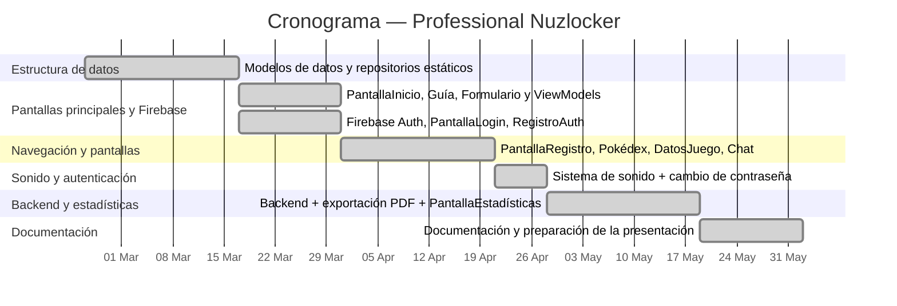

# PROFESSIONAL NUZLOCKER

### *Cristian Morales Canosa — 19/05/2026*

---

## Índice

| # | Sección |
|---|---------|
| 1 | [Introducción](#1-introducción) |
| 2 | [Descripción del proyecto](#2-descripción-del-proyecto) |
| 3 | [Objetivos del proyecto](#3-objetivos-del-proyecto) |
| 4 | [Alcance del proyecto](#4-alcance-del-proyecto) |
| 5 | [Requisitos del proyecto](#5-requisitos-del-proyecto) |
| 6 | [Planificación del proyecto](#6-planificación-del-proyecto) |
| 7 | [Plan de gestión de riesgos](#7-plan-de-gestión-de-riesgos) |
| 8 | [Diseño](#8-diseño) |
| 9 | [Instalación y preparación](#9-instalación-y-preparación) |
| 10 | [Documentación de ejecución y plan de calidad](#10-documentación-de-ejecución-y-plan-de-calidad) |
| 11 | [Distribución](#11-distribución) |
| 12 | [Manuales](#12-manuales) |
| 13 | [Conclusiones](#13-conclusiones) |
| 14 | [Anexos](#14-anexos) |
| 15 | [Índice de tablas e imágenes](#15-índice-de-tablas-e-imágenes) |
| 16 | [Bibliografía y referencias](#16-bibliografía-y-referencias) |

---

## 1. Introducción

### Justificación del proyecto

Pokémon es una de las sagas de videojuegos más populares y reconocidas del mundo, centrada en la exploración, la captura y el combate entre criaturas llamadas Pokémon. Dentro de esta franquicia, títulos como Pokémon Negro y Pokémon Blanco marcaron especialmente mi interés por la saga, tanto por su historia como por la variedad de personajes y criaturas.

En el ámbito de esta franquicia, un Nuzlocke es un reto autoimpuesto en estos juegos que lleva más de dos décadas de historia en la comunidad Pokémon. Sus reglas básicas, como capturar únicamente el primer Pokémon de cada ruta, perder de forma permanente a los que se debilitan, etc., convierten cualquier partida en una experiencia narrativa única, cargada de tensión y apego emocional hacia el equipo, agregándole dificultad y emoción a los que buscan algo más desafiante y diferente.

Sin embargo, gestionar un Nuzlocke manualmente supone un esfuerzo considerable, porque el jugador debe llevar la cuenta de qué rutas ya ha visitado, qué Pokémon ha capturado o perdido, qué combates importantes ha superado, cuántas vidas le quedan... Hoy en día, la mayoría de jugadores, bajo mi experiencia, recurren a hojas de cálculo, blocs de notas en teléfonos, o aplicaciones genéricas de listas, ninguna de las cuales están diseñadas específicamente para este reto.

Professional Nuzlocker es un proyecto que cubre específicamente esto, ya que su fin es el de ofrecer una herramienta móvil nativa, elegante y centrada en la experiencia de un Nuzlocke, que además integra inteligencia artificial (IA) para asistir al jugador durante la partida.

Además del interés técnico y de diseño que supone desarrollar esta aplicación, el proyecto surge también de una motivación personal, ligada a mi afición por los juegos de Pokémon, especialmente Pokémon Blanco/Negro, y por otros referentes en plataformas de streaming como YT que impulsan mi afán por jugar de esta forma tan desafiante y divertida.

---

### Análisis comparativo de aplicaciones similares

Como aplicación de registro de Nuzlockes, no hay demasiada variedad. No obstante, sí existen herramientas que pueden llegar a ayudar de alguna forma a guardar el progreso de una partida.

A continuación se resumen las principales alternativas existentes y sus limitaciones:

| Aplicación / Herramienta | Plataforma | Proósito de Nuzlocke | Seguimiento de Pokémon | IA integrada |
|--------------------------|-----------|:----------------------:|:----------------------:|:------------:|
| Hojas de cálculo (Google Sheets) | Web / Móvil | ✗ | Manual | ✗ |
| Nuzlocke Tracker (web) | Web | ✓ | Orientado pero molesto | ✗ |
| Blocs de notas | Multiplataforma | ✗ | Manual | ✗ |
| **Professional Nuzlocker** | Android | ✓ | Orientado y lógico | ✓ |

Ninguna solución existente combina un seguimiento completo del Nuzlocke cómodo y suficientemente eficaz con una integración de IA funcional.

---

### Tendencias

El proyecto se enmarca en dos tendencias tecnológicas actuales:

- **Integración de IA en aplicaciones móviles:** La incorporación de modelos de lenguaje en apps de consumo es cada vez más habitual, como podemos observar en plataformas y servicios de Google (Gmail, Google Docs, Google Sheets, etc.). Esto se debe a que la IA sirve como herramienta eficaz a la hora de entender el contexto de la aplicación y cómo moverse por esta. Professional Nuzlocker utiliza esta tecnología para ofrecer respuestas personalizadas al estado real de la partida del usuario, ya que la UI es sencilla y cómoda de usar.

- **Desarrollo Android con Jetpack Compose:** La interfaz declarativa de Jetpack Compose es de los estándares más modernos para el desarrollo nativo en Android, facilitando la creación de interfaces reactivas, dinámicas y mantenibles con un código más compacto y legible. Además, su integración con las arquitecturas modernas de Android permite acelerar el desarrollo y mejorar la escalabilidad y mantenibilidad de la aplicación a largo plazo, lo cuál es indispensable para grandes proyectos.

---

### Beneficios o expectativas del proyecto

- El jugador **nunca pierde información** de su partida. Todas las capturas, muertes, combates y estadísticas quedan persistidas en la nube mediante Firebase Firestore, vinculadas a su cuenta personal. Incluso si el jugador decide empezar una nueva partida, su antiguo intento podrá ser guardado a través de la generación de un documento PDF con suficiente información para no olvidar nada.
- La **integración con NuzBot** reduce el tiempo que el jugador dedica a buscar información externa durante la partida, ya que la IA responde realmente rápido a cualquier pregunta.
- La aplicación sirve como **referencia técnica** de una arquitectura Android moderna (MVVM, Compose, Firebase, API REST) aplicada a un dominio concreto y bien acotado.
- Bajo temas personales, el principal beneficio es **la mera existencia** de una herramienta concreta para este tipo de retos que sea suficientemente eficaz y cómoda para poder ser usada de forma continua y diaria por aquellos que son apasionados por la saga.

---

## 2. Descripción del proyecto

### Tipo de proyecto

Como se ha comentado anteriormente, **Professional Nuzlocker** es una **aplicación Android nativa**, la cuál está desarrollada únicamente en Kotlin con Jetpack Compose. Sigue el patrón de arquitectura **MVVM** (Model-View-ViewModel) y utiliza Firebase como backend para autenticación y almacenamiento de datos en tiempo real.

---

### Características principales

| Característica | Descripción | Ventaja |
|----------------|-------------|---------|
| **Autenticación** | Registro e inicio de sesión con correo y contraseña mediante Firebase Auth. | Privacidad de partidas para cada usuario. |
| **Formulario de inicio** | Configuración de la partida (versión del juego, sexo, nombre e inicial). | Asistencia a la hora de empezar el registro. |
| **Registro de rutas** | Lista completa de rutas del juego. En cada ruta el jugador registra el encuentro, donde captura, debilita o espera al encuentro de Pokémon. | Libertad y ayuda para planear encuentros. |
| **Seguimiento de combates** | Registro de combates importantes con el equipo usado en cada uno. | Guía de ayuda para momentos críticos del juego. |
| **Gestión del equipo** | Vista detallada del equipo activo, PC y cementerio, con edición de mote, nivel, habilidad y evolución. | Fluidez a la hora del registro de Pokémon. |
| **Sistema de vidas** | Cada muerte descuenta una vida, donde al llegar a cero el Nuzlocke termina automáticamente. | Añadido de dificultad y ayuda al registro. |
| **NuzBot (IA)** | Asistente conversacional que responde preguntas sobre la partida en curso usando el contexto real de Firestore. | Asistencia clara para resolver dudas ofreciendo estrategias o datos. |
| **Estadísticas** | Resumen final con resultado, ranking de Pokémon más usados, combates más mortales, rivales más letales y distribución de tipos. | Datos importantes para recordar o revisar. |
| **Exportación PDF** | Generación y descarga de un informe completo en la carpeta Descargas del dispositivo. | Guardado del resultado para poder empezar una nueva. |
| **Pokédex integrada** | Navegador de los Pokémon disponibles con buscador por nombre, ofreciendo dónde capturar o cómo evolucionar cada uno. | Información relevante para cada Pokémon. |
| **Música y sonido** | Banda sonora con fundido cruzado al iniciar combates y efectos de sonido contextuales. | Ambiente al navegar por la UI. |

---

### Usuarios destinatarios

La aplicación, como es de esperar, está dirigida a un perfil único y bien definido:

> **Jugador de Pokémon aficionado al reto Nuzlocke**, con conocimientos básicos de las reglas del desafío, que quiere sustituir sus hojas de cálculo o notas manuales por una herramienta móvil dedicada, con la que sentirse a gusto registrando cualquier dato.

No se requiere ningún conocimiento técnico para usar la aplicación. El flujo introductorio guía al jugador desde el registro hasta el inicio de la partida de forma intuitiva. De ahí en adelante, todo es muy sencillo e intuible de usar.

Si el jugador novato e inexperto en el ámbito de los Nuzlockes quiere usar la aplicación, no estará perdido acerca de normas y comportamientos de este modo de juego, debido a que la [**Pantalla de Guía**](app/src/main/java/com/example/professionalnuzlocker/ui/screens/guide/PantallaGuia.kt) le informará de cualquier concepto que necesite saber.

---

## 3. Objetivos del proyecto

### Objetivo general

Desarrollar una aplicación Android completa que permita al usuario **registrar, seguir y analizar una partida Nuzlocke** de Pokémon Negro/Blanco, con persistencia en la nube e integración de un asistente de inteligencia artificial contextual.

---

### Objetivos específicos

1. **Implementar un sistema de autenticación seguro:** Logrado mediante Firebase Authentication, con validación de campos y mensajes de error localizados en español (ES).

2. **Diseñar y desarrollar la estructura de datos de la partida:** Todas las rutas, capturas, combates, y equipo, PC y cementerio y persistirla en tiempo real en Firebase Firestore.

3. **Construir el flujo completo de registro de la aventura:** Selección de ruta activa, captura o pérdida del Pokémon encontrado, registro de combates importantes con el equipo utilizado y gestión de muertes con causa detallada.

4. **Desarrollar la pantalla de gestión del equipo:** Funcionalidades de edición de datos del Pokémon y registro de evoluciones, diferenciando equipo activo, PC y cementerio.

5. **Integrar NuzBot:** Asistente de IA conversacional que recibe el contexto de la partida actual y responde preguntas del jugador a través de un endpoint REST protegido con Firebase ID Token.

6. **Generar un informe de estadísticas:** Al finalizar la partida muestra victoria/derrota, capturas, ranking de Pokémon más usados, combates más mortales, rivales más letales y distribución de tipos en una pantalla.

7. **Implementar la exportación a PDF:** El informe de estadísticas es exportado, guardándolo en la carpeta Descargas del dispositivo como archivo PDF.

8. **Garantizar una experiencia de usuario coherente y pulida:** Paleta de colores propia, música de fondo con fundido cruzado y efectos de sonido acordes al contexto de cada acción.

---

## 4. Alcance del proyecto

### Qué incluye

Professional Nuzlocker cubre el ciclo completo de una partida Nuzlocke sobre Pokémon Negro/Blanco, desde el registro del usuario hasta la exportación en formato PDF de las estadísticas más importantes de la partida. Esto incluye la autenticación, la configuración de la partida, el registro de rutas y encuentros, la gestión del equipo activo, el manejo de PC y cementerio, el seguimiento de combates importantes, el sistema de vidas con fin automático al llegar a cero, el asistente de IA, las estadísticas finales, la exportación a PDF, una Pokédex completa de los Pokémon del juego, música de fondo con fundido cruzado y efectos de sonido, y una pantalla de guía para jugadores nuevos en el modo Nuzlocke.

### Límites

- La aplicación da soporte únicamente a Pokémon Negro/Blanco, y solo existe versión para Android, por lo que no hay versión iOS ni web.
- Cada cuenta puede tener una única partida activa al mismo tiempo.
- No existe ninguna funcionalidad social ni multijugador con las que comparar partidas.
- El presupuesto para este trabajo es de 0€, por lo que el modelo de IA es gratuito y no tan potente.

### Restricciones

- La aplicación requiere conexión a internet activa para todas sus funciones, ya que tanto Firebase como la API de IA son servicios en la nube.
- El dispositivo debe ejecutar Android 8.0 (API 26) o superior.
- La disponibilidad y la latencia de la IA dependen del servicio externo montado paar ello.
- Al tratarse de un proyecto sin ánimo de lucro, la distribución comercial está limitada por los derechos de propiedad de Nintendo y The Pokémon Company, haciendo difícil su lanzamiento futuro.
- El modelo de IA no es tan eficaz y puede dar errores en sus respuestas.

---

## 5. Requisitos del proyecto

### Requisitos funcionales

El sistema debe permitir el registro e inicio de sesión de usuarios con correo electrónico y contraseña, contando también con el cierre de sesión de cuenta. Una vez dentro, el jugador puede configurar una nueva partida indicando la versión del juego, su nombre, sexo y Pokémon inicial elegido.

Durante la partida, la aplicación muestra la lista completa de rutas de Pokémon Negro/Blanco y permite registrar un encuentro por ruta, indicando si el Pokémon fue capturado, derrotado o si el encuentro está pendiente. El jugador gestiona su equipo activo, PC y cementerio, pudiendo editar el mote, nivel, habilidad y estado de cada uno, así como registrar sus evoluciones. Cada muerte descuenta una vida, y, al llegar a cero, el Nuzlocke finaliza automáticamente independientemente de dónde estés. Los combates importantes se registran junto al equipo utilizado en cada uno en el interior del programa.

NuzBot responde preguntas del jugador utilizando el contexto real de su partida almacenada en Firestore. Al terminar la partida, se muestra una pantalla de estadísticas con el resultado, rankings de Pokémon más usados, combates más mortales, rivales más letales y distribución de tipos, que puede exportarse como PDF a la carpeta Descargas del dispositivo. La aplicación también incluye una Pokédex de la región Teselia con buscador por nombre, música de fondo con fundido cruzado, efectos de sonido contextuales y una pantalla de guía con las reglas del modo Nuzlocke.

### Requisitos técnicos

La aplicación está desarrollada de forma nativa en Android usando Kotlin y Jetpack Compose, siguiendo el patrón de arquitectura MVVM. La versión mínima de Android soportada es la 8.0 (API 26). La autenticación se gestiona con Firebase Authentication, la persistencia de datos en tiempo real con Firebase Firestore, y la comunicación con NuzBot a través de un endpoint REST protegido con Firebase ID Token. Los PDF se generan y guardan en la carpeta `Downloads` del dispositivo. El entorno de desarrollo es Android Studio, y el control de versiones se gestiona con Git y GitHub.

### Requisitos legales y normativos

La aplicación debe cumplir el Reglamento General de Protección de Datos (RGPD) en cuanto al almacenamiento y tratamiento de datos personales de usuarios europeos, y respetar los Términos de Servicio de Google y Firebase. Al ser un proyecto sin ánimo de lucro, el uso de nombres, términos e imágenes de Pokémon debe ajustarse a las directrices de Nintendo y The Pokémon Company para proyectos no comerciales. En caso de distribución mediante Google Play, sería necesario proporcionar una política de privacidad accesible al usuario. Los datos del usuario no deben compartirse con terceros de ninguna forma.

---

## 6. Planificación del proyecto

### Estructura de tareas

El desarrollo se organizó en fases secuenciales. La primera fase, de análisis y diseño, cubrió la definición de requisitos, la arquitectura del sistema, el modelado de datos en Firestore y los bocetos de interfaz. A continuación se configuró el entorno de trabajo, siguiendo un proyecto en Android Studio, Firebase y dependencias principales.

El desarrollo de la aplicación se dividió en la UI, la lógica detrás de esta, la conexión con Firebase (Auth y Firestore) y la conexión/creación de un Backend con IA integrada.
- UI: Referido a toda la parte visual del proyecto. Lo que viene a ser las pantallas con sus elementos visuales.
- Lógica: Referido a todas las decisiones tomadas desde dentro del proyecto. Todos los botones de navegación, el sistema de vidas junto al `FIN DE LOCKE`, el sistema de audio silenciado o no, etc.
- Guardado de datos: Referido a conectar un servicio de Firebase para poder guardar y crear usuarios desde la aplicación para guardar en cada uno todo lo necesario.
- Backend: Referido a crear un token gratuito en `OpenRouter` y conectar este a un backend sencillo y fiable definiendo el modelo, pasando el contexto neecsario y limitando su respuesta por fines de productividad a largo plazo.

### Cronograma

El proyecto se desarrolló entre finales de febrero y mayo de 2026, con una duración aproximada de catorce semanas. Como se puede ver en el siguiente cronograma, el principio del desarrollo comenzó declarando los datos necesarios para el futuro de la aplicación, como los objetos [`Pokemon`](app/src/main/java/com/example/professionalnuzlocker/data/model/Pokemon.kt), [`CombateImportante`](app/src/main/java/com/example/professionalnuzlocker/data/model/CombateImportante.kt), [`Rutas`](app/src/main/java/com/example/professionalnuzlocker/data/model/enum_classes/Rutas.kt), [`TipoCombate`](app/src/main/java/com/example/professionalnuzlocker/data/model/enum_classes/TipoCombate.kt), etc. 

Tras la primera semana, se estuvo trabajando durante 2 semanas en las clases [`Pokedex`](app/src/main/java/com/example/professionalnuzlocker/data/repository/Pokedex.kt), [`CombateRepository`](app/src/main/java/com/example/professionalnuzlocker/data/repository/CombateRepository.kt) y [`RutasRepository`](app/src/main/java/com/example/professionalnuzlocker/data/repository/RutasRepository.kt), declarando y organizando todos los datos estáticos y globales de la aplicación para todos los usuarios. 

Tras esto, y durante 2 semanas, se programaron las pantallas principales ([`PantallaInicio`](app/src/main/java/com/example/professionalnuzlocker/ui/screens/home/PantallaInicio.kt), [`PantallaGuia`](app/src/main/java/com/example/professionalnuzlocker/ui/screens/home/PantallaInicio.kt), [`PantallaFormulario`](app/src/main/java/com/example/professionalnuzlocker/ui/screens/form/PantallaFormulario.kt)) junto a sus ViewModels ([`PantallaInicioViewModel`](app/src/main/java/com/example/professionalnuzlocker/ui/screens/home/PantallaInicioViewModel.kt), [`PantallaFormularioViewModel`](app/src/main/java/com/example/professionalnuzlocker/ui/screens/form/PantallaFormularioViewModel.kt)). Además, la lógica de Firebase también se pudo conseguir en esta semana, junto a las pantallas [`PantallaLogin`](app/src/main/java/com/example/professionalnuzlocker/ui/screens/auth/PantallaLogin.kt) y [`PantallaRegistroAuth`](app/src/main/java/com/example/professionalnuzlocker/ui/screens/auth/PantallaRegistroAuth.kt). 

Por las siguientes 3 semanas, el sistema de navegación entre [`PantallaRegistro`](app/src/main/java/com/example/professionalnuzlocker/ui/screens/register/PantallaRegistro.kt), [`PantallaPokedex`](app/src/main/java/com/example/professionalnuzlocker/ui/screens/pokedex/PantallaPokedex.kt), [`PantallaDatosJuego`](app/src/main/java/com/example/professionalnuzlocker/ui/screens/infoRun/PantallaDatosJuego.kt) y [`PantallaChat`](app/src/main/java/com/example/professionalnuzlocker/ui/screens/chat/PantallaChat.kt) estaría completado, y las 3 primeras ya funcionales parcialmente, mostrando Pokémon, rutas y combates adecuadamente. 

La siguiente semana todo el trabajo se centró en el sonido y cambio de contraseña de Auth en la aplicación. 

Por último, en las semanas 10-12 se realizó, en su mayoría, el funcionamiento del [`Backend`](https://github.com/moraalees/ProfessionalNuzlocker-BE), siguiendo el guardado de archivos PDF y la [`PantallaEstadisticas`](app/src/main/java/com/example/professionalnuzlocker/ui/screens/stats/PantallaEstadisticas.kt). 

Las semanas 13-14 fueron dedicadas a documentación del proyecto y preparación de la presentación de este.

### Recursos necesarios

**Recursos técnicos:** Android Studio como IDE principal, Kotlin y Jetpack Compose para el código de la aplicación, Git y GitHub para el control de versiones, Firebase Authentication y Firestore como backend, un servicio REST externo para NuzBot, una librería Android de generación de PDF, Coil para la carga de imágenes en la Pokédex, Retrofit para el consumo de la API de NuzBot, y al menos un dispositivo Android físico o emulador para las pruebas de funcionamiento y comportamiento.

**Recursos humanos:** Un único desarrollador, responsable de todo el proceso de desarrollo de inicio a fin, contando el análisis, diseño, desarrollo, pruebas y documentación del proyecto.

---

## 7. Plan de gestión de riesgos

### Identificación y evaluación de riesgos

- **Expansión descontrolada del alcance**: Probabilidad baja/media, impacto alto. Es el riesgo más prioritario del proyecto, ya que la adición de funcionalidades no planificadas puede comprometer el calendario y los objetivos del TFG.

- **Interrupción o cambio en la API de Firebase**: Probabilidad muy baja, impacto alto. Una rotura en la autenticación o en Firestore dejaría la aplicación sin backend funcional, por lo que ningún usuario podría crear una cuenta y mucho menos guardar sus partidas, inutilizando toda la aplicación.

- **Corte o limitación de tasa del servicio de IA**: Probabilidad media, impacto medio/bajo. NuzBot depende de un servicio externo (Render). Si este no está disponible, el asistente queda inoperativo completamente.

- **Retrasos por subestimación de tareas**: Probabilidad media, impacto medio. Habitual en proyectos individuales donde no hay margen para redistribuir carga.

- **Pérdida o corrupción de datos en Firestore**: Probabilidad muy baja, impacto alto. Aunque sea bastante improbable, podría suponer la pérdida de toda la partida del usuario e inutilizar cualquier lógica dentro del proyecto.

- **Incompatibilidad con versiones de Android no probadas**: Probabilidad baja, impacto medio. El amplio rango de versiones soportadas puede introducir comportamientos inesperados.

- **Errores en la generación del PDF en dispositivos concretos**: Probabilidad baja, impacto bajo. La fragmentación del ecosistema Android puede provocar fallos puntuales en la exportación del archivo.

- **Alta latencia en las respuestas de NuzBot**: Probabilidad media, impacto bajo. Afecta a la UX, pero no a la funcionalidad como tal.

### Recursos preventivos

- Para evitar el scope creep, el alcance se definió desde el inicio, evaluando cualquier nueva funcionalidad frente al calendario antes de implementarla.
  
- Para mitigar la dependencia de Firebase, la arquitectura MVVM aísla la capa de datos en repositorios intercambiables.
  
- NuzBot muestra un indicador de carga visible y un mensaje de error claro cuando el servicio no responde.
  
- El desarrollo se estructuró en tareas pequeñas con estimaciones realistas y revisión semanal del progreso.
  
- Las reglas de seguridad de Firestore protegen contra escrituras no autorizadas, y la estructura de datos se valida en el ViewModel antes de persistirse.

### Plan de mitigación de consecuencias

- Si Firebase sufre una interrupción grave, la capa repositorio permite migrar a otro proveedor (Supabase, Room local, ...) sin reescribir la lógica de negocio.
  
- Si NuzBot deja de estar disponible, se desactiva su sección en la interfaz y se muestra un aviso al usuario, estudiando un proveedor alternativo.

- Si se materializan retrasos, se reduce el pulido visual para priorizar la funcionalidad nuclear y se ajusta el cronograma.

- Si se produce corrupción de datos en Firestore, el historial interno del servicio permite restaurarlos. En un caso ya más extremo, se ofrece al usuario reiniciar la partida.

---

## 8. Diseño

> *Sección pendiente de desarrollo.*

---

## 9. Instalación y preparación

> *Sección pendiente de desarrollo.*

---

## 10. Documentación de ejecución y plan de calidad

> *Sección pendiente de desarrollo.*

---

## 11. Distribución

> *Sección pendiente de desarrollo.*

---

## 12. Manuales

> *Sección pendiente de desarrollo.*

---

## 13. Conclusiones

> *Sección pendiente de desarrollo.*

---

## 14. Anexos

> *Sección pendiente de desarrollo.*

---

## 15. Índice de tablas e imágenes

> *Sección pendiente de desarrollo.*

---

## 16. Bibliografía y referencias

> *Sección pendiente de desarrollo.*
